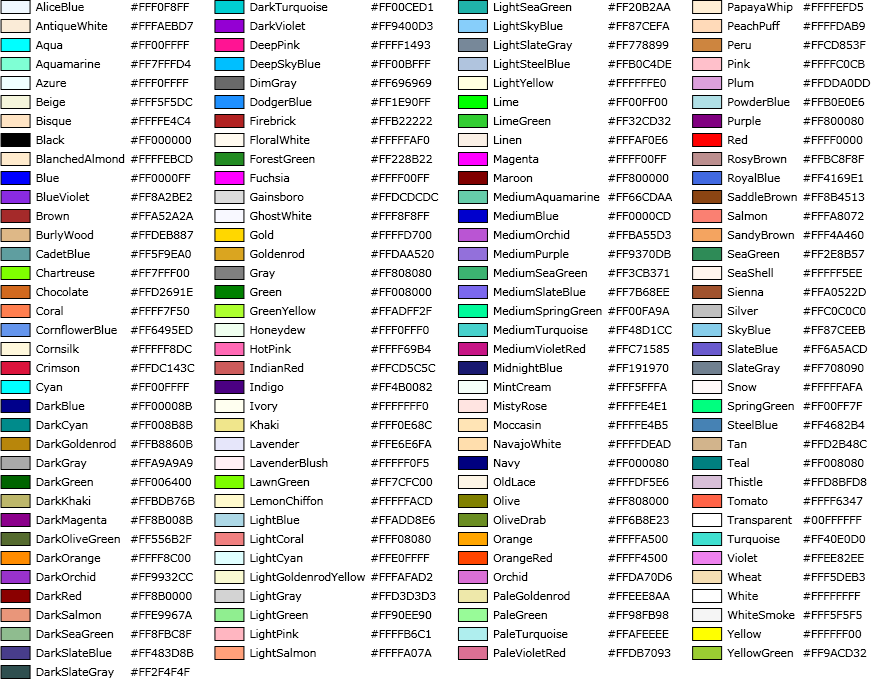

.. _diagram_customization:

**************************
  Diagram Customization
**************************

Diagram appearance can be customized using attributes. This page provides an overview of customization capabilities.

.. seealso:: :ref:`diagram_schema_attributes`

Block Archetypes
================

Hercules supports a number of block archetypes - predefined block shapes for different purposes. There's no problem
mixing blocks designed for different purposes in the same diagram.

Archetype is set with the ``diagram archetype`` attribute on the block record.

The following table contains archetypes supported by Hercules:

+-----------------------+------------------------------+----------------------------+
| Archetype             | Appearance                   | Purpose                    |
+=======================+==============================+============================+
| ``box``               | square                       | General purpose            |
+-----------------------+------------------------------+----------------------------+
| ``rhomb``             | rhomb                        | General purpose            |
+-----------------------+------------------------------+----------------------------+
| ``hexagon``           | hexagon                      | General purpose            |
+-----------------------+------------------------------+----------------------------+
| ``trapeze``           | trapeze                      | General purpose            |
+-----------------------+------------------------------+----------------------------+
| ``barrel``            | barrel                       | General purpose            |
+-----------------------+------------------------------+----------------------------+
| ``penta_down``        | pentagon looking down        | General purpose            |
+-----------------------+------------------------------+----------------------------+
| ``penta_left``        | pentagon looking left        | General purpose            |
+-----------------------+------------------------------+----------------------------+
| ``penta_right``       | pentagon looking right       | General purpose            |
+-----------------------+------------------------------+----------------------------+
| ``penta_up``          | pentagon looking up          | General purpose            |
+-----------------------+------------------------------+----------------------------+
| ``box_lite``          | small square                 | General purpose            |
+-----------------------+------------------------------+----------------------------+
| ``rhomb_lite``        | small rhomb                  | General purpose            |
+-----------------------+------------------------------+----------------------------+
| ``hexagon_lite``      | small hexagon                | General purpose            |
+-----------------------+------------------------------+----------------------------+
| ``trapeze_lite``      | small trapeze                | General purpose            |
+-----------------------+------------------------------+----------------------------+
| ``barrel_lite``       | small barrel                 | General purpose            |
+-----------------------+------------------------------+----------------------------+
| ``penta_down_lite``   | small pentagon looking down  | General purpose            |
+-----------------------+------------------------------+----------------------------+
| ``penta_left_lite``   | small pentagon looking left  | General purpose            |
+-----------------------+------------------------------+----------------------------+
| ``penta_right_lite``  | small pentagon looking right | General purpose            |
+-----------------------+------------------------------+----------------------------+
| ``penta_up_lite``     | small pentagon looking up    | General purpose            |
+-----------------------+------------------------------+----------------------------+
| ``window``            | box with caption and content | General purpose            |
+-----------------------+------------------------------+----------------------------+
| ``root``              |                              | AI behavior tree           |
+-----------------------+------------------------------+----------------------------+
| ``sequence``          |                              | AI behavior tree           |
+-----------------------+------------------------------+----------------------------+
| ``selector``          |                              | AI behavior tree           |
+-----------------------+------------------------------+----------------------------+
| ``decorator``         |                              | AI behavior tree           |
+-----------------------+------------------------------+----------------------------+
| ``behaviour``         |                              | AI behavior tree           |
+-----------------------+------------------------------+----------------------------+
| ``interceptor``       |                              | AI behavior tree           |
+-----------------------+------------------------------+----------------------------+
| ``condition``         |                              | AI behavior tree           |
+-----------------------+------------------------------+----------------------------+
| ``check``             |                              | AI behavior tree           |
+-----------------------+------------------------------+----------------------------+
| ``parallel``          |                              | AI behavior tree           |
+-----------------------+------------------------------+----------------------------+
| ``start``             |                              | Mission flow               |
+-----------------------+------------------------------+----------------------------+
| ``success``           |                              | Mission flow               |
+-----------------------+------------------------------+----------------------------+
| ``failure``           |                              | Mission flow               |
+-----------------------+------------------------------+----------------------------+
| ``spawn``             |                              | Mission flow               |
+-----------------------+------------------------------+----------------------------+
| ``objective``         |                              | Mission flow               |
+-----------------------+------------------------------+----------------------------+
| ``dialog``            |                              | Mission flow               |
+-----------------------+------------------------------+----------------------------+
| ``asset``             |                              | Mission flow               |
+-----------------------+------------------------------+----------------------------+
| ``random``            |                              | Mission flow               |
+-----------------------+------------------------------+----------------------------+
| ``helper``            |                              | Mission flow               |
+-----------------------+------------------------------+----------------------------+
| ``timer``             |                              | Mission flow               |
+-----------------------+------------------------------+----------------------------+

.. warning:: Mission blocks are supported mostly for backward compatibility. It is recommended to use general purpose blocks instead.

Icons
=====

Hercules allows to associate an icon with a block. An icon is displayed both on the block shape and in the toolbox. 

Mission and AI blocks have predefined icons, but they can still be overridden. 

Hercules supports 3570 Fugue icons, available here: https://p.yusukekamiyamane.com/

Icon name can be set with an ``icon`` attribute and should be prefixed with ``fugue-``:

.. code-block:: igor

    [diagram archetype="box" icon="fugue-guitar']  

Icon visibility can be toggled with ``show_icon`` attribute.

Special Fields
==============

Diagram blocks have limited support for dynamic content - block field values can be displayed inside the block. This can be achieved using ``special_field`` attribute.

.. code-block:: igor

    record AbilityAction.AbilityActionHeal[heal]
    {
        [diagram special_field="text"]
        float amount;
    }

Attribute ``[diagram special_field="text"]`` is supported by most blocks. It is valid on scalar fields, including optional, but not on collections. 
The field value will be displayed inside the block.

Colors
======

*General purpose* blocks support color customization. This can be achieved using ``[diagram color="red"]`` attribute. The value of the attribute is the string containing
the color in one of the following formats:
    
    * Hex **ARGB** color string, for example ``#FFFF0000`` is red
    * One of the predefined colors names (case insensitive), see the table below.

Connector colors can be altered the same way, using **connector** object attribute, for example:

.. code-block:: igor

    [diagram connector=(name="IN" type=asset position="0,0.5" color="blue")]

When using connector categories, it is recommended that different categories use different colors.
